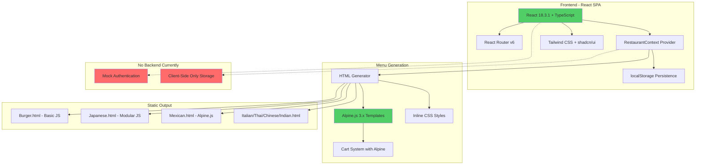

# Menu Creator - Project Analysis (2025-11-03)

## 📊 Executive Summary
Menu Creator is a **restaurant digital menu generator** that transforms traditional paper menus into beautiful, interactive HTML pages with shopping cart functionality. Built on React/TypeScript/Vite, it enables restaurant owners to create mobile-optimized digital menus without coding, featuring live preview, template customization, and one-click HTML export. The project is production-ready for basic use cases but has significant architectural inconsistencies between its React SPA editor and Alpine.js-generated static menus.

## 🎯 Key Findings
- **✅ Strengths**: Clean UI/UX, functional menu editor, excellent visual customization, working cart system
- **⚠️ Critical Issues**: No backend/auth (mock login), dual-framework maintenance burden, inconsistent state management
- **🚀 Quick Wins**: Add real authentication, unify on single framework, implement proper persistence layer
- **📈 Strategic Vision**: Could evolve into full restaurant SaaS with ordering, payments, and analytics

## 🏗️ System Architecture



## 🔍 Detailed Analysis
For comprehensive technical details, architecture deep-dive, and migration strategies, see:
- **[Architecture & Tech Analysis](./ARCHITECTURE_TECH_ANALYSIS.md)** - 5,000+ word technical deep-dive

## 🛣️ Next Steps for Revival

### Immediate (< 1 week)
1. **Enable Lovable Cloud** for real auth and persistence
2. **Remove mock login** and implement proper user management
3. **Add database schema** for restaurants, menus, users
4. **Fix navigation highlighting** bug (in progress)

### Medium-term (1-4 weeks)
1. **Unify on Alpine.js** - Migrate React dashboard to Alpine or vice versa
2. **Multi-restaurant support** - One user, many restaurants
3. **Real HTML export** with download functionality
4. **Deploy to production** with custom domain

### Long-term (> 1 month)
1. **Payment integration** (Stripe) for premium features
2. **Analytics dashboard** - Track menu views, popular items
3. **QR code generation** for print menus linking to digital
4. **White-label solution** for menu service providers

## ⚠️ Critical Warnings
- **No data persistence beyond localStorage** - Users lose data on cache clear
- **Mock authentication is insecure** - Anyone can access any "account"
- **Framework split is technical debt** - React editor generates Alpine menus
- **No multi-tenancy** - Can't manage multiple restaurants

---

## Project Info (Original)

**URL**: https://lovable.dev/projects/8f127f81-e367-41b2-a671-77ebab9b3c18

## How can I edit this code?

There are several ways of editing your application.

**Use Lovable**

Simply visit the [Lovable Project](https://lovable.dev/projects/8f127f81-e367-41b2-a671-77ebab9b3c18) and start prompting.

Changes made via Lovable will be committed automatically to this repo.

**Use your preferred IDE**

If you want to work locally using your own IDE, you can clone this repo and push changes. Pushed changes will also be reflected in Lovable.

The only requirement is having Node.js & npm installed - [install with nvm](https://github.com/nvm-sh/nvm#installing-and-updating)

Follow these steps:

```sh
# Step 1: Clone the repository using the project's Git URL.
git clone <YOUR_GIT_URL>

# Step 2: Navigate to the project directory.
cd <YOUR_PROJECT_NAME>

# Step 3: Install the necessary dependencies.
npm i

# Step 4: Start the development server with auto-reloading and an instant preview.
npm run dev
```

**Edit a file directly in GitHub**

- Navigate to the desired file(s).
- Click the "Edit" button (pencil icon) at the top right of the file view.
- Make your changes and commit the changes.

**Use GitHub Codespaces**

- Navigate to the main page of your repository.
- Click on the "Code" button (green button) near the top right.
- Select the "Codespaces" tab.
- Click on "New codespace" to launch a new Codespace environment.
- Edit files directly within the Codespace and commit and push your changes once you're done.

## What technologies are used for this project?

This project is built with .

- Vite
- TypeScript
- React
- shadcn-ui
- Tailwind CSS

## How can I deploy this project?

Simply open [Lovable](https://lovable.dev/projects/8f127f81-e367-41b2-a671-77ebab9b3c18) and click on Share -> Publish.

## I want to use a custom domain - is that possible?

We don't support custom domains (yet). If you want to deploy your project under your own domain then we recommend using Netlify. Visit our docs for more details: [Custom domains](https://docs.lovable.dev/tips-tricks/custom-domain/)

---

**📜 Previous README Versions:**
- This is the first comprehensive analysis - Original README preserved above
- Analysis generated: 2025-11-03
