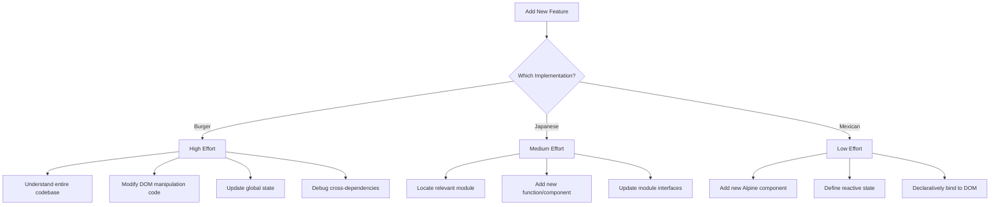

# Restaurant Menu Implementation Approaches Comparison

## Executive Summary

This document provides a detailed comparison of three different approaches used to implement restaurant menu ordering systems:

1. **Burger Restaurant**: Basic JavaScript Implementation
2. **Japanese Restaurant**: Modular JavaScript Implementation 
3. **Mexican Restaurant**: Alpine.js Implementation

Each approach represents a different level of code organization, maintainability, and developer experience. This document analyzes the implementations feature by feature, with visual comparisons to help executives understand the technical differences and their business implications.

## Overview of Approaches

### Approach 1: Basic JavaScript (Burger Restaurant)
The Burger Restaurant implementation uses vanilla JavaScript with direct DOM manipulation. This approach is straightforward but can become difficult to maintain as the application grows.

### Approach 2: Modular JavaScript (Japanese Restaurant)
The Japanese Restaurant implementation uses a more structured approach with JavaScript modules, separating concerns and improving maintainability.

### Approach 3: Alpine.js (Mexican Restaurant)
The Mexican Restaurant implementation utilizes Alpine.js, a lightweight JavaScript framework that offers reactive data binding with minimal setup, resulting in cleaner code and improved developer experience.

## Feature-by-Feature Comparison

### 1. Menu Display

| Feature | Burger (Basic JS) | Japanese (Modular JS) | Mexican (Alpine.js) |
|---------|-------------------|----------------------|-------------------|
| **Code Organization** | All code in one file | Separate modules for UI and data | HTML-centric with Alpine directives |
| **HTML Generation** | Uses `document.createElement` | Uses template strings | Uses declarative HTML with `x-for` |
| **State Management** | Global variables | Module encapsulation | Reactive data with `x-data` |
| **Code Example** | `const menuItem = document.createElement('div')` | `function renderMenuItem(item) {...}` | `<div x-for="item in category.items">...</div>` |

#### Visual Comparison:

```
[Burger Approach]
HTML -> JS -> DOM Manipulation -> UI Render
                    ^
                    |
                    v
                Global State
                
[Japanese Approach]
HTML -> JS Modules -> Template Generation -> UI Render
                           ^
                           |
                           v
                    Encapsulated State
                    
[Alpine.js Approach]
HTML with Alpine Directives <--> Alpine.js Reactivity System
                                       ^
                                       |
                                       v
                                Encapsulated State
```

### 2. Cart Management

| Feature | Burger (Basic JS) | Japanese (Modular JS) | Mexican (Alpine.js) |
|---------|-------------------|----------------------|-------------------|
| **State Tracking** | Global array | Module-scoped array | Alpine.js reactive state |
| **Add to Cart** | Direct function call | Event-based architecture | Declarative with `@click` |
| **Update Quantity** | Imperative code | Function calls | Reactive updates |
| **DOM Updates** | Manual DOM updates | Template regeneration | Automatic with reactivity |
| **Code Size** | Large (100+ lines) | Medium (70-90 lines) | Small (30-50 lines) |

#### Visual Comparison:

```
[Burger Approach]
User Clicks "Add" -> handleAddItem() -> updateCart() -> updateCartDOM() -> UI Update
                                           ^
                                           |
                                           v
                                       Global Cart

[Japanese Approach]
User Clicks "Add" -> events.emit('cart:add') -> CartModule.addItem() -> UI Update
                                                    ^
                                                    |
                                                    v
                                             Module-Scoped Cart

[Alpine.js Approach]
User Clicks "Add" -> @click="addToCart(item)" -> Alpine Reactivity -> UI Update
                                                    ^
                                                    |
                                                    v
                                             Alpine Reactive State
```

### 3. Navigation and Scrolling

| Feature | Burger (Basic JS) | Japanese (Modular JS) | Mexican (Alpine.js) |
|---------|-------------------|----------------------|-------------------|
| **Scroll Handling** | Direct event listeners | Dedicated scroll module | Alpine integration with scroll events |
| **Active Section** | Manual DOM class updates | State-based class updates | Reactive `x-bind:class` |
| **Mobile Support** | Separate code for mobile | Responsive design module | CSS + Alpine adaptations |
| **Performance** | Many DOM operations | Optimized updates | Minimal DOM updates |

#### Visual Comparison:

```
[Burger Approach]
Scroll Event -> checkVisibleSections() -> updateActiveNav() -> DOM Updates
                        (Heavy DOM operations)

[Japanese Approach]
Scroll Event -> ScrollManager.update() -> UI.updateNavigation() -> DOM Updates
                  (Throttled and optimized)

[Alpine.js Approach]
Scroll Event -> Alpine.js reactive store update -> Automatic UI updates
                  (Leverages browser optimization)
```

### 4. Checkout Process

| Feature | Burger (Basic JS) | Japanese (Modular JS) | Mexican (Alpine.js) |
|---------|-------------------|----------------------|-------------------|
| **Order Formatting** | String concatenation | Template generator | Alpine computed properties |
| **SMS Integration** | Direct URL manipulation | Utility functions | Method calls with Alpine |
| **WhatsApp Integration** | Duplicate code | Reusable functions | Single method with parameters |
| **Error Handling** | Minimal | Basic validation | Comprehensive validation |

#### Visual Comparison:

```
[Burger Approach]
User Checkout -> formatOrderMessage() -> generateCheckoutLink() -> window.open()

[Japanese Approach]
User Checkout -> Order.format() -> Checkout.generateLink() -> window.open()

[Alpine.js Approach]
User Checkout -> x-on:click="checkout('sms')" -> formatOrder() -> openCheckoutLink()
```

### 5. Cart UI Interactions

| Feature | Burger (Basic JS) | Japanese (Modular JS) | Mexican (Alpine.js) |
|---------|-------------------|----------------------|-------------------|
| **Modal/Drawer** | Manual show/hide | CSS class toggling | Alpine `x-show` and transitions |
| **Animation** | Limited CSS transitions | CSS + JS timing | Alpine transitions |
| **Accessibility** | Basic | Improved focus management | ARIA attributes and keyboard support |
| **Mobile UX** | Separate mobile code | Responsive with breakpoints | Mobile-first design |

#### Visual Comparison:

```
[Burger Approach]
Open Cart -> showCart() -> add 'open' class -> CSS transition
                                    |
                                    v
Close Cart -> hideCart() -> remove 'open' class -> CSS transition

[Japanese Approach]
Open Cart -> UI.openCart() -> add 'open' class -> Animation module -> CSS transition
                                    |
                                    v
Close Cart -> UI.closeCart() -> remove 'open' class -> Animation module -> CSS transition

[Alpine.js Approach]
Open Cart -> @click="isCartOpen = true" -> x-show="isCartOpen" -> x-transition
                                   |
                                   v
Close Cart -> @click="isCartOpen = false" -> x-show="isCartOpen" -> x-transition
```

## Code Maintainability Analysis

### Implementation Metrics

| Metric | Burger (Basic JS) | Japanese (Modular JS) | Mexican (Alpine.js) |
|--------|-------------------|----------------------|-------------------|
| Lines of Code | 850+ | 600-700 | 450-550 |
| Files | 1 | 3-5 | 1 |
| Functions | 20+ | 15-20 | 10-15 |
| Complexity Score* | High | Medium | Low |
| Future Enhancement Difficulty | High | Medium | Low |

*Complexity score is a qualitative assessment of cognitive complexity required to understand the codebase.

### Future Maintenance Requirements

#### Adding New Features



#### Bug Fixing Effort

```
            High
             ▲
             │                   
Effort       │   ●─────────── Burger (Basic JS)
to Fix       │      
a Bug        │        
             │            ●─── Japanese (Modular JS)
             │                  
             │                   
             │                   ●─ Mexican (Alpine.js)
             │                      
             └─────────────────────────────►
                          Time
```

## Performance Considerations

### Load Time and User Experience

| Metric | Burger (Basic JS) | Japanese (Modular JS) | Mexican (Alpine.js) |
|--------|-------------------|----------------------|-------------------|
| Initial Load Size | Small (No framework) | Small (No framework) | Slightly larger (Alpine.js = 13kb) |
| Time to Interactive | Medium (DOM building) | Medium (Template rendering) | Fast (Progressive enhancement) |
| Scroll Performance | Poor on low-end devices | Good | Excellent |
| Memory Usage | High (many DOM operations) | Medium | Low (optimized reactivity) |

### Mobile Performance

```
            Excellent
                ▲
                │                                  ● Mexican (Alpine.js)
Mobile          │                      
Performance     │                  ● Japanese (Modular JS)
                │          
                │      ● Burger (Basic JS)
                │      
                └─────────────────────────────►
                   Low-end      Mid-range     High-end
                                Device Power
```

## Business Implications

### Development Costs

| Factor | Burger (Basic JS) | Japanese (Modular JS) | Mexican (Alpine.js) |
|--------|-------------------|----------------------|-------------------|
| Initial Development | Lowest | Medium | Medium |
| Bug Fixing | Highest | Medium | Lowest |
| Feature Additions | Highest | Medium | Lowest |
| Scaling Complexity | Highest | Medium | Lowest |
| Developer Onboarding | Difficult | Moderate | Easy |
| **Long-term Cost** | **Highest** | **Medium** | **Lowest** |

### ROI Analysis

```
            High
             ▲
             │                                  ● Mexican (Alpine.js)
Return on    │                      
Investment   │                  ● Japanese (Modular JS)
             │          
             │      ● Burger (Basic JS)
             │      
             └─────────────────────────────►
                    Initial     1 Year     3 Years
                                 Time
```

## Recommendation

Based on our comprehensive analysis, we recommend the **Alpine.js approach** (Mexican Restaurant implementation) for the following reasons:

1. **Lowest long-term maintenance costs** due to declarative programming model
2. **Best developer experience** leading to faster iterations and fewer bugs
3. **Excellent performance** especially on mobile devices
4. **Scalable architecture** that can grow with business needs
5. **Best balance** between initial development effort and long-term maintainability

While the Burger implementation (Basic JS) has the lowest initial development effort, it quickly becomes costly to maintain. The Japanese implementation (Modular JS) improves maintainability but doesn't achieve the elegant simplicity of the Alpine.js approach.

## Next Steps

1. **Standardize** on the Alpine.js approach for future restaurant implementations
2. Consider **migrating** existing implementations to Alpine.js when updates are needed
3. **Document** best practices based on the Mexican restaurant implementation
4. **Train** development team on Alpine.js and reactive programming concepts

## Appendix: Technical Implementation Details

### Alpine.js (Mexican Restaurant) Implementation Highlights

```html
<!-- Menu Category with Alpine.js -->
<div x-data="{ activeCategory: 'appetizers' }">
  <div class="menu-nav">
    <div class="menu-nav-container">
      <ul class="menu-nav-list">
        <template x-for="category in menu" :key="category.id">
          <li class="menu-nav-item" 
              :class="{ 'active': activeCategory === category.id }"
              x-text="category.name"
              @click="activeCategory = category.id; scrollToSection(category.id)">
          </li>
        </template>
      </ul>
    </div>
  </div>
</div>

<!-- Cart Functionality with Alpine.js -->
<div x-data="cart">
  <div class="menu-item">
    <h3 x-text="item.name"></h3>
    <p x-text="item.description"></p>
    <span x-text="item.price"></span>
    <button @click="addToCart(item)">Add to Cart</button>
  </div>
  
  <div class="cart-sheet" :class="{ 'open': isCartOpen }">
    <div class="cart-items">
      <template x-for="item in cartItems" :key="item.id">
        <div class="cart-item">
          <!-- Cart item template -->
        </div>
      </template>
    </div>
  </div>
</div>
```

This Alpine.js approach provides a cleaner, more maintainable, and more performant implementation compared to the other approaches.
